  

  <b>Computer Science Student</b> • <b>C++ Learner</b> • <b>Future Software Engineer</b>

---

## 🚀 Currently Learning

- 💻 C++
- 📚 Data Structures & Algorithms
- 🧠 Object-Oriented Programming
- 🌐 Web Development

---

## 🎯 2026 Goals

- ✅ Master C++
- 🔄 Solve 300+ DSA Problems
- 🚀 Build Real-World Projects
- 🌍 Learn Full-Stack Development
- 🤝 Contribute to Open Source

---

## 🛠️ Tech Stack

### Languages

### Tools

---

## 📊 GitHub Stats

> Coming Soon — Custom Animated Stats (Built from Scratch)

---

## 🖥️ Projects

Projects will appear here as I continue learning and building.

---

## 📫 Connect With Me

- GitHub: https://github.com/Arnav12n6
- LinkedIn: https://www.linkedin.com/in/arnav-agrawal-083921376/

---

  <i>“Keep learning. Keep building.”</i>

